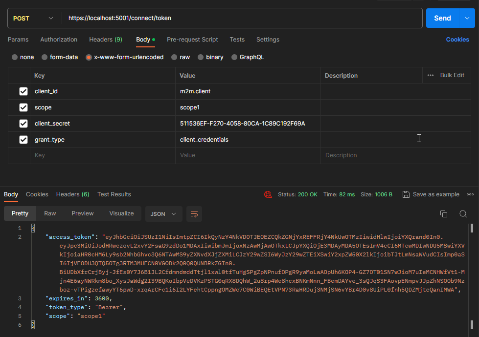

# Duende IdentityServer Demo 3 (Sql Server + ASP.NET Identity + EF Core)

## Setup

I'm using .NET Core 6.

list donet sdks and make sure version 6 is available.
in my case, i have 6.0.412 so I use that.

```shell
dotnet --list-sdks
# 6.0.412 [C:\Program Files\dotnet\sdk]
# 7.0.403 [C:\Program Files\dotnet\sdk]
```

create a new global.json file in the directory where you will create the solution.
in my case, I will create the solution under D:\dev\dotnet folder
so I'll add the global.json folder in the dotnet folder

```shell
# create a new global.json file
dotnet new globaljson
```

edit global.json to target the version 6 sdk.
you should now have a global.json folder in D:\dev\dotnet folder

```json
{
  "sdk": {
    "version": "6.0.412"
  }
}
```

open the Command Prompt and make sure you are under D:\dev\dotnet directory.
uninstall and install/reinistall the duende identityserver template.
run `dotnet new --list` to ensure that the template is installed.

```shell
# uninstall
dotnet new --uninstall Duende.IdentityServer.Templates

# install
dotnet new --install Duende.IdentityServer.Templates

# list templates
dotnet new --list
```

first, create an empty solution project called `Duende.IdentityServer.Demo3`.
then cd into that directory.

```shell
cd /d/dev/dotnet
dotnet new sln -o Duende.IdentityServer.Demo3
cd Duende.IdentityServer.Demo3
```

create a new project using the asp.net core identity template.
I called mine `Duende.IdentityServer.SqlServer`

```shell
cd /d/dev/dotnet/Duende.IdentityServer.Demo3
dotnet new isaspid -o Duende.IdentityServer.SqlServer
```

open the solution in Visual Studio by double-clicking the `Duende.IdentityServer.Demo3.sln` file.
add existing project `Duende.IdentityServer.SqlServer` to the solution.

delete `Microsoft.EntityFrameworkCore.Sqlite` nuget package
and install `Microsoft.EntityFrameworkCore.SqlServer` nuget package.
also install `Duende.IdentityServer.EntityFramework` nuget package.

```shell
Uninstall-Package Microsoft.EntityFrameworkCore.Sqlite
Install-Package Microsoft.EntityFrameworkCore.SqlServer -Version 6.0.0
Install-Package Duende.IdentityServer.EntityFramework -Version 6.3.2
```

edit `HostingExtensions.cs` file.
create variables `connectionString` & `migrationsAssembly` and place it above the line containing `builder.Services.AddRazorPages();`.
update `AddDbContext` to use sql server w/ connectionString var.
comment out or delete the `.AddInMemory` lines.
add configuration store & operational store.

```cs
// begin add1
var connectionString = builder.Configuration.GetConnectionString("DefaultConnection");

var migrationsAssembly = typeof(Program).Assembly.GetName().Name;
// end add1

builder.Services.AddRazorPages();

builder.Services.AddDbContext<ApplicationDbContext>(options =>
{
    // update
    options.UseSqlServer(connectionString, o => o.MigrationsAssembly(migrationsAssembly));
});

builder.Services.AddIdentity<ApplicationUser, IdentityRole>()
    .AddEntityFrameworkStores<ApplicationDbContext>()
    .AddDefaultTokenProviders();

builder.Services.AddIdentityServer(options =>
{
    options.Events.RaiseErrorEvents = true;
    options.Events.RaiseInformationEvents = true;
    options.Events.RaiseFailureEvents = true;
    options.Events.RaiseSuccessEvents = true;

    // see https://docs.duendesoftware.com/identityserver/v6/fundamentals/resources/
    options.EmitStaticAudienceClaim = true;
})
// begin add2
.AddConfigurationStore(options =>
{
    options.ConfigureDbContext = b => b.UseSqlServer(connectionString,
        sql => sql.MigrationsAssembly(migrationsAssembly));
})
.AddOperationalStore(options =>
{
    options.ConfigureDbContext = b => b.UseSqlServer(connectionString,
        sql => sql.MigrationsAssembly(migrationsAssembly));
})
// end add2
// comment out or remove
// .AddInMemoryIdentityResources(Config.IdentityResources)
// .AddInMemoryApiScopes(Config.ApiScopes)
// .AddInMemoryClients(Config.Clients)
.AddAspNetIdentity<ApplicationUser>();
```

edit ConnectionStrings in `appsettings.json`

```json
{
  // before
  "ConnectionStrings": {
    "DefaultConnection": "Data Source=AspIdUsers.db;"
  },
  // after
  "ConnectionStrings": {
    "DefaultConnection": "Server=(localdb)\\mssqllocaldb;Database=AspIdUsers;Trusted_Connection=True"
  }
}
```

use Package Manager Console in Visual Studio to add migrations for the configuration store & operational store.

```shell
Get-Migration -Context ApplicationDbContext
Remove-Migration -Context ApplicationDbContext
Drop-Database -Context ApplicationDbContext

Add-Migration InitialIdentityServerMigration -Context ApplicationDbContext -OutputDir Data/Migrations/ApplicationDb
Add-Migration InitialIdentityServerMigration -Context ConfigurationDbContext -OutputDir Data/Migrations/ConfigurationDb
Add-Migration InitialIdentityServerMigration -Context PersistedGrantDbContext -OutputDir Data/Migrations/PersistedGrantDb

Update-Database -Context ApplicationDbContext
Update-Database -Context ConfigurationDbContext
Update-Database -Context PersistedGrantDbContext

Get-Migration -Context ApplicationDbContext
Get-Migration -Context ConfigurationDbContext
Get-Migration -Context PersistedGrantDbContext

# Remove-Migration -Context ApplicationDbContext
# Remove-Migration -Context ConfigurationDbContext
# Remove-Migration -Context PersistedGrantDbContext
```

you can also delete `buildschema.bat` & `buildschema.sh` files

now we need to seed the database.

first, update `Config.cs` file to the following.
we are basically creating an api scope called `weatherApiScope`, then setting that as the allowed scope in our clients.
we are also creating an api resource called `weatherApiResource` and setting the scope as `weatherApiScope`.

Config.cs

```cs
using Duende.IdentityServer.Models;

namespace Duende.IdentityServer.SqlServer;

public static class Config
{
    public static IEnumerable<IdentityResource> IdentityResources =>
        new IdentityResource[]
        {
            new IdentityResources.OpenId(),
            new IdentityResources.Profile(),
        };

    public static IEnumerable<ApiScope> ApiScopes =>
        new ApiScope[]
        {
            new ApiScope("weatherApiScope"),
        };

    public static IEnumerable<Client> Clients =>
        new Client[]
        {
            // m2m client credentials flow client
            new Client
            {
                ClientId = "m2m.client",
                ClientName = "Client Credentials Client",

                AllowedGrantTypes = GrantTypes.ClientCredentials,
                ClientSecrets = { new Secret("511536EF-F270-4058-80CA-1C89C192F69A".Sha256()) },

                AllowedScopes = { "weatherApiScope" }
            },

            // interactive client using code flow + pkce
            new Client
            {
                ClientId = "interactive",
                ClientSecrets = { new Secret("49C1A7E1-0C79-4A89-A3D6-A37998FB86B0".Sha256()) },

                AllowedGrantTypes = GrantTypes.Code,

                RedirectUris = { "https://localhost:44300/signin-oidc" },
                FrontChannelLogoutUri = "https://localhost:44300/signout-oidc",
                PostLogoutRedirectUris = { "https://localhost:44300/signout-callback-oidc" },

                AllowOfflineAccess = true,
                AllowedScopes = { IdentityServerConstants.StandardScopes.OpenId, IdentityServerConstants.StandardScopes.Profile, "weatherApiScope" }
            },
        };

    public static IEnumerable<ApiResource> ApiResources =>
        new ApiResource[]
        {
            new ApiResource("weatherApiResource")
            {
                Scopes = { "weatherApiScope" },
                ApiSecrets = { new Secret("ScopeSecret".Sha256()) },
            }
        };
}
```

next, update `SeedData.cs` to the following so it seeds the config & users.

SeedData.cs

```cs
using Duende.IdentityServer.EntityFramework.DbContexts;
using Duende.IdentityServer.EntityFramework.Mappers;
using Duende.IdentityServer.Models;
using Duende.IdentityServer.SqlServer.Data;
using Duende.IdentityServer.SqlServer.Models;
using IdentityModel;
using Microsoft.AspNetCore.Identity;
using Microsoft.EntityFrameworkCore;
using Serilog;
using System.Security.Claims;

namespace Duende.IdentityServer.SqlServer;

public class SeedData
{
    public static void EnsureSeedData(WebApplication app)
    {
        using var scope = app.Services.GetRequiredService<IServiceScopeFactory>().CreateScope();
        scope.ServiceProvider.GetService<ApplicationDbContext>().Database.Migrate();
        scope.ServiceProvider.GetService<PersistedGrantDbContext>().Database.Migrate();

        var context = scope.ServiceProvider.GetService<ConfigurationDbContext>();
        context.Database.Migrate();
        EnsureSeedData(context);
        EnsureUsers(scope);
    }

    private static void EnsureSeedData(ConfigurationDbContext context)
    {
        if (!context.Clients.Any())
        {
            Log.Debug("Clients being populated");
            foreach (var client in Config.Clients.ToList())
            {
                context.Clients.Add(client.ToEntity());
            }
            context.SaveChanges();
        }
        else
        {
            Log.Debug("Clients already populated");
        }

        if (!context.IdentityResources.Any())
        {
            Log.Debug("IdentityResources being populated");
            foreach (var resource in Config.IdentityResources.ToList())
            {
                context.IdentityResources.Add(resource.ToEntity());
            }
            context.SaveChanges();
        }
        else
        {
            Log.Debug("IdentityResources already populated");
        }

        if (!context.ApiScopes.Any())
        {
            Log.Debug("ApiScopes being populated");
            foreach (var resource in Config.ApiScopes.ToList())
            {
                context.ApiScopes.Add(resource.ToEntity());
            }
            context.SaveChanges();
        }
        else
        {
            Log.Debug("ApiScopes already populated");
        }

        if (!context.ApiResources.Any())
        {
            Log.Debug("ApiResources being populated");
            foreach (var resource in Config.ApiResources.ToList())
            {
                context.ApiResources.Add(resource.ToEntity());
            }
            context.SaveChanges();
        }
        else
        {
            Log.Debug("ApiResources already populated");
        }

        if (!context.IdentityProviders.Any())
        {
            Log.Debug("OIDC IdentityProviders being populated");
            context.IdentityProviders.Add(new OidcProvider
            {
                Scheme = "demoidsrv",
                DisplayName = "IdentityServer",
                Authority = "https://demo.duendesoftware.com",
                ClientId = "login",
            }.ToEntity());
            context.SaveChanges();
        }
        else
        {
            Log.Debug("OIDC IdentityProviders already populated");
        }
    }

    private static void EnsureUsers(IServiceScope scope)
    {
        var userMgr = scope.ServiceProvider.GetRequiredService<UserManager<ApplicationUser>>();
        var alice = userMgr.FindByNameAsync("alice").Result;
        if (alice == null)
        {
            alice = new ApplicationUser
            {
                UserName = "alice",
                Email = "AliceSmith@email.com",
                EmailConfirmed = true,
            };
            var result = userMgr.CreateAsync(alice, "Pass123$").Result;
            if (!result.Succeeded)
            {
                throw new Exception(result.Errors.First().Description);
            }

            result = userMgr.AddClaimsAsync(alice, new Claim[]{
                            new Claim(JwtClaimTypes.Name, "Alice Smith"),
                            new Claim(JwtClaimTypes.GivenName, "Alice"),
                            new Claim(JwtClaimTypes.FamilyName, "Smith"),
                            new Claim(JwtClaimTypes.WebSite, "http://alice.com"),
                        }).Result;
            if (!result.Succeeded)
            {
                throw new Exception(result.Errors.First().Description);
            }
            Log.Debug("alice created");
        }
        else
        {
            Log.Debug("alice already exists");
        }

        var bob = userMgr.FindByNameAsync("bob").Result;
        if (bob == null)
        {
            bob = new ApplicationUser
            {
                UserName = "bob",
                Email = "BobSmith@email.com",
                EmailConfirmed = true
            };
            var result = userMgr.CreateAsync(bob, "Pass123$").Result;
            if (!result.Succeeded)
            {
                throw new Exception(result.Errors.First().Description);
            }

            result = userMgr.AddClaimsAsync(bob, new Claim[]{
                            new Claim(JwtClaimTypes.Name, "Bob Smith"),
                            new Claim(JwtClaimTypes.GivenName, "Bob"),
                            new Claim(JwtClaimTypes.FamilyName, "Smith"),
                            new Claim(JwtClaimTypes.WebSite, "http://bob.com"),
                            new Claim("location", "somewhere")
                        }).Result;
            if (!result.Succeeded)
            {
                throw new Exception(result.Errors.First().Description);
            }
            Log.Debug("bob created");
        }
        else
        {
            Log.Debug("bob already exists");
        }
    }
}
```

Now seed the database by right-clicking on the `Duende.IdentityServer.Sqlite` project and selecting Properties.
Select Debug on the left menu and under General, select Open debug launch profiles UI link.
Enter /seed for the Command line arguments.

Once the database is seeded, make sure to remove the command line argument.

## Demo 1

let's see if we can get an access token.

run `Duende.IdentityServer.SqlServer`.

execute the following command in a shell using curl to get an access token

```shell
curl -X POST -H "content-type: application/x-www-form-urlencoded" -H "Cache-Control: no-cache" -d "client_id=m2m.client&scope=weatherApiScope&client_secret=511536EF-F270-4058-80CA-1C89C192F69A&grant_type=client_credentials" "https://localhost:5001/connect/token"
```

or use Postman to get access token


